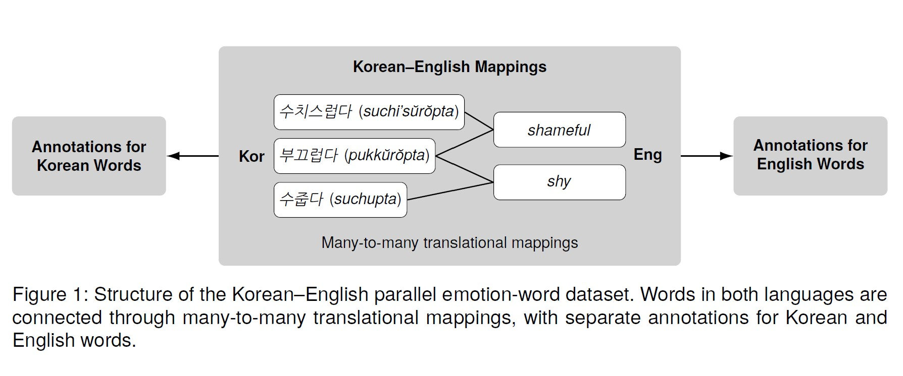

# EVOKE
This is a public repository of EVOKE (Emotion Vocabulary Of Korean and English) dataset.

Shield: [![CC BY-NC 4.0][cc-by-nc-shield]][cc-by-nc]

This work is licensed under a
[Creative Commons Attribution-NonCommercial 4.0 International License][cc-by-nc].

[![CC BY-NC 4.0][cc-by-nc-image]][cc-by-nc]

[cc-by-nc]: https://creativecommons.org/licenses/by-nc/4.0/
[cc-by-nc-image]: https://licensebuttons.net/l/by-nc/4.0/88x31.png
[cc-by-nc-shield]: https://img.shields.io/badge/License-CC%20BY--NC%204.0-lightgrey.svg

---
## About the dataset
The dataset offers comprehensive coverage of emotion words in each language, in addition to many-to-many translations between words in the two languages and identification of language-specific emotion words (or cross-lingual lexical gaps). The dataset contains 1,427 Korean words and 1,399 English words, and we systematically annotate 819 Korean and 924 English djectives and verbs.

## Structure of the dataset
The dataset consists of three separate components (see Figure 1):
1. [Korean-English mappings](./Korean_English_mappings/)
2. [Annotations for Korean words](./Korean_annotations/)
3. [Annotations for English words](./English_annotations/)

Each dataset component includes its own codebook describing file contents, variable definitions, and annotation labels. Please refer to the `README.md` file inside each dataset folder for documentation of each dataset component.

Please refer to the paper for annotation criteria, construction of translation mappings, and descriptive statistics of the dataset.

---
## Citation

